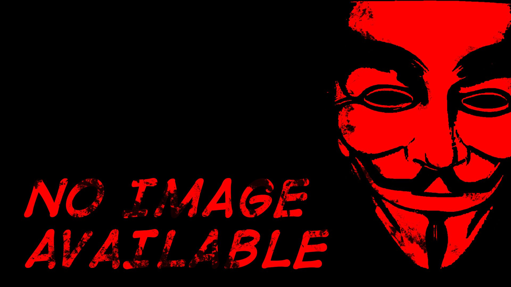

# Anonymous-dp V2



## Anonymous-dp updated !!!

#### Many <span style="background-color:red;border-radius:5px;padding:2px;font-weight:bold;">new</span> features are unlocked in this version.

### features

- Obtaining the initial letters from the user's first name and last name and drawing them at the center of the display picture (DP).

- Applying any color to the initial letters.

- The initial letters also automatically adjust their color based on the background, using complementary function.

- Adjustable font size of initial letters.

- Adjustable font color of initial letters.

- Random Colors for DP and initial letters in mode 3.

| Features                     | Mode-1  | Mode-2  | Mode-3  |
| ---------------------------- | ------- | ------- | ------- |
| Background Pattern           | &#9745; | &#9745; | &#9746; |
| Initial letters              | &#9746; | &#9745; | &#9746; |
| background solid color       | &#9746; | &#9746; | &#9745; |
| random profile picture Color | &#9746; | &#9746; | &#9745; |
| random letter Color          | &#9746; | &#9745; | &#9745; |
| complementary letter color   | &#9746; | &#9745; | &#9745; |
| manual letter color          | &#9746; | &#9745; | &#9745; |

## docs

- <a href="#live-preview">Live Previews</a>

  - <a href="#mode-home">Home Page</a>
  - <a href="#mode-1">mode-1</a>
  - <a href="#mode-2">mode-2</a>
  - <a href="#mode-3">mode-3</a>

- <a href="#intergration">Anonymous-dp Intergration</a>

  - <a href="#cdn">via CDN</a>
  - <a href="#locally">via Locally</a>

<!-- - <a href="#implement">Implementation in HTML Page</a>

  - <a href="#scripts">Scripts</a>
  - <a href="#styles">Styles</a>
  - <a href="#widgets">Widgets</a> -->

- <a href="#using-html">Using Anonymous-dp in HTML webpage</a>

  - <a href="#Supported-Classes">Supported-Classes</a>

  - <a href="#elements">Elements</a>

    - <a href="#showFName">Showing First & Last Name in a Element</a>

  - <a href="#canvas">Canvas</a>
    - <a href="#canvas-mods">Modes</a>
    - <a href="#canvas-font-size">Font-size</a>
    - <a href="#canvas-complementary">Complementary color</a>
  - <a href="#functional">Creating Functional Elements</a>
    - <a href="#save-btn">Save button</a>
    - <a href="#regenerate-btn">Regenerate Button</a>
    - <a href="#Name-Edit">Name Editor Inputs</a>
    - <a href="#cp-btn">Color Picker Radio</a>

- <a href="#dev-note">Developer Note</a>

## Live Preview

### <span id="mode-home">Home Page</span>

Live preview available on :
https://rizmyabdulla.github.io/Anonymous-dp/demo/

### <span id="mode-1">Mode-1 Live Preview</span>

Live preview available on :
https://rizmyabdulla.github.io/Anonymous-dp/demo/mode1.html

### <span id="mode-2">Mode-2 Live Preview</span>

Live preview available on :
https://rizmyabdulla.github.io/Anonymous-dp/demo/mode2.html

### <span id="mode-3">Mode-3 Live Preview</span>

Live preview available on :
https://rizmyabdulla.github.io/Anonymous-dp/demo/mode3.html

## <span id="intergration">Anonymous-dp Intergration</span>

### <span id="cdn">Via CDN</span>

#### you can intergrate Anonymous-dp from CDN (jsdeliver)

import javascript code via :
`<script src="https://cdn.jsdelivr.net/gh/RizmyAbdulla/Anonymous-dp@main/js/Anonymous-dp.js`

```
<script src="https://cdn.jsdelivr.net/gh/RizmyAbdulla/Anonymous-dp@main/js/Anonymous-dp.js
```

### <span id="locally">Via Locally</span>

#### you can intergrate Anonymous-dp by Downloading js files

import javascript code :
`path/to/Anonymous-dp.js`

```
<script src="path/to/Anonymous-dp.js"></script>
```

## <span id="using-html">Using Anonymous-dp in HTML webpage</span>

### <span id="Supported-Classes">Supported Classes For Canvas</span>

| Classes                             | Mode-1  | Mode-2  | Mode-3  |
| ----------------------------------- | ------- | ------- | ------- |
| profile-font-color-{hex color code} | &#9746; | &#9745; | &#9745; |
| profile-font-size-{1-10}            | &#9746; | &#9745; | &#9745; |
| profile-font-complementary          | &#9746; | &#9745; | &#9746; |
| profile-random-dp-color             | &#9746; | &#9746; | &#9745; |
| profile-random-font-color           | &#9746; | &#9745; | &#9745; |

### <span id="elements">Elements</span>

#### <span id="showFName"> Showing First & Last Name in a Element</span>

Mode-1 needs two text element with `profile-fname` and `profile-lname` classes to get initial letters.

```
<p class="profile-fname">Rizmy</p>
<p class="profile-lname">Abdulla</p>
```

#### <span id="canvas"> Canvas</span>

##### <span id="canvas-mods">Modes</span>

our Canvas(profile picture) has three modes classes,`mode-1`,`mode-2` and `mode-3` .lets put all together.

using `mode-1` class

```
<canvas id="profile-picture"
        class="mode-1"
        width="200"
        height="200">
</canvas>
```

using `mode-2` class

```
<canvas id="profile-picture"
        class="mode-2 profile-font-size-7 profile-font-Complementary
        width="200"
        height="200">
</canvas>
```

using `mode-3` class

```
<canvas id="profile-picture"
        class="mode-3 profile-font-size-7 profile-font-color-433656"
        width="200"
        height="200">
</canvas>
```

##### <span id="canvas-font-size">Font-size</span>

We can use `profile-font-size-7` class to adjust initial letters on profile picture.

supported modes : `mode-2`,`mode-3`

```
<canvas id="profile-picture"
        class="mode-3 profile-font-size-7
        width="200"
        height="200">
</canvas>
```

##### <span id="canvas-complementary">Complementary color</span>

We can use `profile-font-Complementary` class to auto assign reliable color for initial letters according to Background color on profile picture.

supported modes : `mode-2`,`mode-3`

Note: In `mode-3`,Complementary color can be apply for initial letters When Profile Picture is set to `profile-random-dp-color`

```
<canvas id="profile-picture"
        class="mode-3 profile-font-Complementary profile-random-dp-color"
        width="200"
        height="200">
</canvas>
```

#### <span id="functional">Creating Functional Elements</span>

##### <span id="save-btn">Save button</span>

Use `profile-save-dp` id to save the DP.

```
<button id="profile-save-dp">Save DP</button>
```

##### <span id="regenerate-btn">Regenerate Button</span>

Use `profile-generate-dp` id to Regenerate a DP.

```
<button id="profile-generate-dp">Generate DP</button>
```

##### <span id="Name-Edit">Name Editor Inputs</span>

Use `profile-fname-input` and `profile-lname-input` classes name to Edit UserName

```
<input type="text" class="profile-fname-input" placeholder="first name" />
<input type="text" class="profile-lname-input" placeholder="last name" />
```

##### <span id="cp-btn">Color Picker Button</span>

Use `profile-color-picker` to Pick a color for initial Letters.

```
<input type="color" id="profile-color-picker" />
```

## <span id="dev-note">Developer Note</span>

#### If you find this project useful or interesting, please consider giving it a star on GitHub by clicking the Star button at the top. Your support is greatly appreciated! &#10084;

#### Contributions are welcome! If you find any bugs or want to improve the project, please open an issue or submit a pull request. Make sure to follow the contribution guidelines mentioned in the repository.
